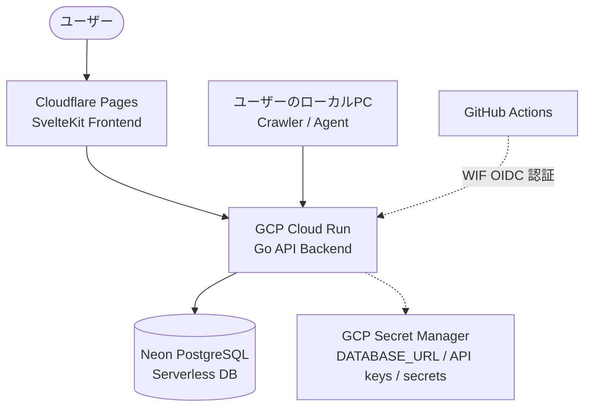

# Room Finder MVP 仕様書

## 1. 目的

賃貸物件ポータルサイトから物件情報を定期的に取得し、ユーザーが最初に入力した自然言語の条件をすべて満たす物件を抽出・保存する。

初期版は自分専用のサービスとし、物件情報を継続的に蓄積する基盤を作ることを目的とする。

## 2. MVP の対象範囲

- 対象サイトは LIFULL HOME'S の1サイトとする
- 物件の取得は毎日実行する
- 初回プロンプトを検索プロファイルとして保存する
- Agent は初回プロンプトから検索条件を解釈する
- 解釈された条件はすべて必須条件として扱う
- 必須条件をすべて満たした物件だけを保存する
- 保存する物件情報は、取得元から取得可能な現在情報を可能な範囲で含める
- 物件情報は最新状態のみ保持する
- Web UI の詳細設計は後続で決める
- Web/API/DB/デプロイ基盤は `../buildlog` と同一アーキテクチャを採用する

## 3. 検索プロファイル

検索プロファイルは、ユーザーが入力した初回プロンプトと、それを解釈した検索条件をまとめた単位とする。

- プロファイルごとに一意の ID を持つ
- 作成後の条件変更は行わない
- 条件を変えたい場合は、新しいプロファイルを作成する
- 毎日のクロールでは、保存済みのプロファイルを再利用する
- 初期版ではユーザーアカウントや権限管理を持たない

## 4. Agent の責務

Agent は次の処理を担当する。

1. 初回プロンプトから検索条件を抽出する
2. LIFULL HOME'S の検索に必要な条件を整理する
3. 取得した物件情報から条件判定に必要な値を抽出する
4. 必須条件をすべて満たすか判定する
5. 構造化された物件情報と判定結果・根拠を返す
6. 定義済みの保存APIを呼び出す

Agent が情報を推測して補完してはならない。取得元に記載がない値は不明として扱う。

Agent はDBへ直接接続せず、SQLも実行しない。Agentが扱うのは、サービス側が定義した構造化データ形式と保存APIだけとする。

## 5. Agent と API の責務分離

```text
ローカルAgent
  ↓ 検索・抽出・条件判定
構造化された物件情報
  ↓ 保存API呼び出し
Go API
  ↓ 入力検証・重複判定・保存
Neon PostgreSQL
```

Agentが返す物件情報には、取得元URL・取得日時・各項目の根拠を含める。Go APIは次の検証を行ってから保存する。

- リクエスト形式と必須項目
- 数値・日付・URLなどのデータ型
- 取得元サイトとURL
- 検索プロファイルの存在
- 必須条件の判定結果
- 同一物件の重複登録

AgentやブラウザからNeon PostgreSQLへ直接接続してはならない。

## 6. 取得・保存方針

取得した物件のうち、検索プロファイルの必須条件をすべて満たした物件だけを保存する。

可能な範囲で取得する情報の例は以下のとおりとする。

- 物件名・建物名
- 住所
- 家賃
- 管理費・共益費
- 敷金・礼金などの初期費用情報
- 間取り
- 専有面積
- 築年数
- 階数
- 方角
- 駅・路線・徒歩分数
- 設備・特徴
- 取扱不動産会社
- 物件 URL
- 取得日時

取得可能な情報はサイトの掲載内容に依存する。情報が存在しない項目は無理に補完せず、不明または未設定として扱う。

物件情報は現在状態のみ保持し、家賃変更・掲載終了・再掲載などの履歴は MVP の対象外とする。

## 7. 実行フロー

```text
保存済み検索プロファイルを読み込む
  ↓
LIFULL HOME'S を検索する
  ↓
検索結果・物件詳細から情報を取得する
  ↓
Agent が物件情報を抽出する
  ↓
必須条件をすべて満たすか判定する
  ↓
一致した物件をGo APIへ送信する
  ↓
Go APIが検証して最新状態で保存する
```

## 8. 再試行方針

取得・抽出・API送信に失敗した物件は、可能な限り再試行する。トークン使用量だけでなく、外部サイトのレート制限やAPI障害を考慮して、失敗の種類に応じて扱いを分ける。

- 一時的な通信エラー・タイムアウト・レート制限：待機して再試行する
- Agentの形式不正：指定スキーマを再提示して再試行する
- 情報不足・対象外・条件不一致：再試行せず、その理由を記録する
- 保存APIの一時的な失敗：同じ物件を安全に再送できるようにする
- 実行単位の再試行上限は設定可能にする
- 上限到達後も未完了データを破棄せず、次回実行で再開できるようにする

同じ物件を何度再試行しても重複登録されないよう、保存APIは冪等性を持たせる。

## 9. 0件の場合

必須条件を満たす物件が0件の場合は、0件として扱う。Agent やサービスが条件を自動的に緩和してはならない。

## 10. MVP の対象外

- 複数サイト対応
- 条件の優先度付けやランキング
- ユーザーの反応からの好みの学習
- 物件情報の履歴管理
- 通知
- ユーザーアカウント・権限管理
- Web UI の詳細仕様

## 11. 後続で決める事項

- LIFULL HOME'S の取得方法と利用条件の確認
- Agent が使用する API とモデル
- Web UI の画面構成
- 日次クロールをPC上で実行する方式と、buildlog準拠のAPIとの接続方式
- 物件の重複判定方法
- 2サイト目以降の追加

## 12. アーキテクチャ

Web/API/DB/デプロイ基盤は、`../buildlog` のアーキテクチャをそのまま採用する。



### 技術スタック

- フロントエンド：SvelteKit、TypeScript、Tailwind CSS
- フロントエンドホスティング：Cloudflare Pages
- バックエンド：Go、chi、GORM
- バックエンドホスティング：GCP Cloud Run（東京リージョン、min-instances 0）
- データベース：Neon PostgreSQL
- シークレット管理：GCP Secret Manager
- CI/CD：GitHub Actions + GCP Workload Identity Federation
- マイグレーション：Atlas
- ローカル開発DB：Docker Compose の PostgreSQL

### データ入力経路

物件情報の取得・Agentによる抽出・初回プロンプトの入力は、ユーザーのローカルPC上で行う。

- Web UIからの操作は Cloudflare Pages からGo APIを経由する
- ローカルPC上のCrawler / Agentからのデータ注入もGo APIを経由する
- ローカルPCやWebブラウザからNeon PostgreSQLへ直接接続しない
- Go APIが入力値を検証し、Neon PostgreSQLへ保存する

### ローカル開発環境

`../buildlog` と同様に、ローカル開発では Docker Compose で PostgreSQL を起動し、Go API・SvelteKitを個別に起動する。

### クロール実行

日次クロールは初期方針として自分のPCから実行する。クロール処理の配置、スケジュール実行、Cloud Run APIとの接続方法は、上記アーキテクチャを崩さない範囲で後続Issueにて決定する。
